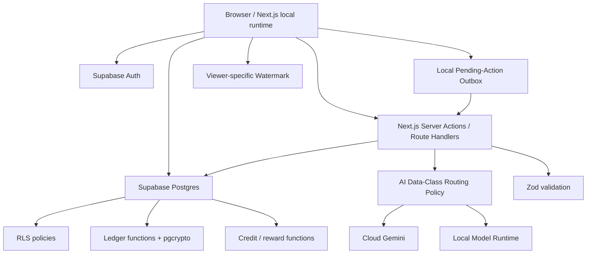

# Architecture — Gardenia 2K26 MVP v2

## 1. Stack

- Next.js App Router
- TypeScript
- Tailwind CSS
- shadcn/ui
- Supabase Auth
- Supabase Postgres
- Supabase RLS
- PostgreSQL `pgcrypto`
- Gemini API for public data
- Local model runtime (recommended: Ollama or another already-tested local HTTP inference runtime)
- Zod
- Vercel AI SDK only where it reduces agent-loop code
- Browser-native local storage/IndexedDB for the pending-action outbox

### Deployment decision

For the hackathon demo, **local Next.js + local model + cloud Supabase** is the safest architecture because confidential AI processing must remain on the team's machine.

Vercel deployment is optional after the hackathon unless a trusted private inference endpoint is available. A normal Vercel function cannot access a model running on the developer laptop.

## 2. System diagram



## 3. AI routing rule

The router is a deterministic server-side policy.

```text
if data_classification == PUBLIC:
    cloud Gemini is allowed
elif data_classification in {CONFIDENTIAL, MIXED, UNKNOWN}:
    local model only
```

**Never:** confidential → Gemini as a fallback.

### Local failure

1. Try local model.
2. If unavailable, return a deterministic/local template fallback.
3. Mark the operation `LOCAL_AI_UNAVAILABLE`.
4. Never send the confidential input to the cloud provider.

### Cloud failure

For public tasks only:
1. try cached deterministic result;
2. otherwise show a retry/error state.

## 4. Data model

### profiles
- id uuid PK
- display_name text
- role text
- skills text[]
- verified boolean
- created_at timestamptz

### projects
- id uuid PK
- sponsor_id uuid
- title text
- public_summary text
- engagement_model text
- data_sensitivity text: public/confidential/mixed
- status text: active/sponsor_withdrawn/work_stopped/complete
- created_at timestamptz

### project_private_briefs
- project_id uuid PK/FK
- confidential_brief text

RLS: accepted project members + sponsor + authorized admin.

### charters
- id uuid PK
- project_id uuid
- version integer
- engagement_model text
- budget numeric nullable
- milestones_json jsonb
- roles_json jsonb
- ip_terms text
- publication_terms text
- confidentiality_terms text
- permitted_ai_tools text
- credit_reward_terms text
- exit_dispute_terms text
- sponsor_withdrawal_terms text
- commercialisation_terms text
- created_at timestamptz

### charter_acceptances
- id uuid PK
- charter_id uuid
- user_id uuid
- accepted_at timestamptz
- engagement_ack boolean

### project_members
- project_id uuid
- user_id uuid
- role text
- status text
- joined_at timestamptz

### milestones
- id uuid PK
- project_id uuid
- title text
- description text
- required_skills text[]
- status text
- amount numeric

### contributions
- id uuid PK
- project_id uuid
- milestone_id uuid
- owner_id uuid
- summary text
- content_hash text
- ai_assisted boolean
- ai_provider text: cloud/local/none
- status text
- created_at timestamptz

### reviews
- id uuid PK
- contribution_id uuid
- reviewer_id uuid
- quality smallint
- usefulness smallint
- evidence smallint
- decision text
- notes text
- created_at timestamptz

`impact_score = quality + usefulness + evidence`, max 5.

### escrows
- id uuid PK
- milestone_id uuid
- amount numeric
- status text: unfunded/funded/released/protected
- funded_at timestamptz
- released_at timestamptz

### payouts
- id uuid PK
- milestone_id uuid
- user_id uuid
- pool text
- credit_weight numeric
- share numeric
- amount numeric
- explanation jsonb

### disputes
- id uuid PK
- project_id uuid
- contribution_id uuid nullable
- raised_by uuid
- reason text
- status text
- resolution text nullable
- resolved_by uuid nullable
- created_at timestamptz

### agent_runs
- id uuid PK
- project_id uuid
- owner_id uuid
- task text
- ai_provider text: cloud/local
- data_classification text
- output text
- status text
- created_at timestamptz

Do not store confidential prompts in cloud telemetry.

### credentials
- id uuid PK
- project_id uuid
- user_id uuid
- type text
- title text
- issued_at timestamptz
- metadata jsonb

## 5. Local pending-action outbox

Not a server database table.

Browser local storage/IndexedDB stores:

```text
idempotency_id
created_at
action_type
project_id
charter_version
payload
status: pending/synced/conflict
```

Allowed examples:
- draft contribution submission
- contribution submission intent
- dispute creation intent

Never store as authoritative local state:
- final credit balance
- final payout amount
- ledger entry hash
- escrow release
- permission grants

On sync, the server validates current auth, membership, charter version and project state before committing anything.

## 6. Credit system

Research Credits are **derived**, not client-authored.

```text
contribution_credits = approved impact_score
user_research_credits = sum(approved contribution_credits)
```

For funded work, the configured role pool is split by reviewed contribution weight.

Example live formula:

```text
student_pool = configured milestone pool
member_share = member_credit_weight / total_student_credit_weight
member_amount = student_pool * member_share
```

Show the inputs and arithmetic.

The handout's stated ₹1,00,000 example remains a golden fixture test only; the live MVP uses internally consistent configurable arithmetic.

## 7. Sponsor-abandonment protection

Server state machine:

```text
ACTIVE
  ↓ sponsor withdraws
SPONSOR_WITHDRAWN
  ↓ stop new work
WORK_STOPPED
  ↓ preserve accepted contributions
PROTECTED_CREDIT
```

Rules:
- accepted contributions remain credited;
- Research Credits do not decrease because the sponsor stopped the project;
- funded escrow remains in a protected state until the agreed acceptance window/process;
- no new milestone work begins;
- disputes remain possible.

## 8. Watermark

No extra server service required.

Render a repeated translucent overlay on confidential content:

```text
USER: Arjun
PROJECT: RET-EDGE-001
VIEWED: 2026-10-05 12:34
```

MVP purpose: discourage screenshots/sharing and provide traceability.

It does **not** prove plagiarism by itself.

## 9. Ledger design

Each entry contains:
- project_id
- actor_id
- action
- entity_type
- entity_id
- payload
- created_at
- prev_hash
- entry_hash

```text
entry_hash = SHA256(prev_hash + canonical_payload)
```

Production UPDATE/DELETE is blocked.

Corrections create new signed entries.

### Tamper Lab

Never change the production ledger.

A DB function copies the relevant chain into a temporary representation, changes an old payload, and runs verification. The UI shows the first mismatch.

## 10. API/server operations

| Operation | Input | Output |
|---|---|---|
| POST project | summary, sensitivity, brief | project |
| POST charter | terms, withdrawal policy | charter v1 |
| POST charter/accept | charter_id | acceptance |
| GET private brief | project_id | brief if RLS permits |
| POST scope | project_id | 2 validated milestones |
| POST match | project_id | ranked candidates |
| POST agent/run | project_id, owner_id, prompt | agent result + route |
| POST contribution | milestone, summary, owner, AI flag/provider | contribution |
| POST review | contribution, scores | review + credit |
| POST escrow/fund | milestone | funded escrow |
| POST escrow/release | milestone | released escrow |
| POST project/withdraw | project_id | protected project state |
| POST dispute | contribution/reason | dispute |
| GET ledger/verify | project_id | PASS/FAIL |
| POST tamper-lab | project_id | simulated FAIL |
| POST credential | project/user | credential |

## 11. Security matrix

| Threat | MVP | Mechanism |
|---|---|---|
| Plagiarism / undisclosed AI | BUILT/MOCKED | seeded similarity + AI-use declaration + agent log |
| Insider theft | BUILT/LIMITED | separate private brief + RLS + viewer watermark |
| Sponsor theft/abandonment | BUILT/SIMULATED | charter withdrawal terms + escrow state + protected credit |
| Credit theft | BUILT | reviewed contribution + hash ledger + human owner |
| Fake accounts | SIMULATED | synthetic verified users + role controls |
| AI leakage / prompt injection | BUILT | sensitivity routing, local-only confidential path, scoped agent, content-as-data |
| Bait-and-switch terms | SHOULD-HAVE | charter version + re-acceptance |
| Ledger/payment tampering | BUILT | blocked mutation + hash verification |

## 12. Corner cases

Prepare at least five; prioritize:

1. Sponsor goes silent/abandons project: accepted work protected, work stopped, credit preserved.
2. Student quits: accepted work retains credit; access revoked.
3. AI wrote most of it: human owner gets credit; AI assistance disclosed.
4. Contribution gaming: review impact, not commit count.
5. Paid becomes unpaid: new charter version; re-accept or leave with accepted credit.
6. Research fails: documented effort remains a valid contribution.
7. Unfair rejection: dispute references review/ledger evidence.
8. Under-18 paid work: guardian consent is production-only; MVP uses synthetic adults.

## 13. External failures

### Cloud Gemini fails
- public tasks use cached/deterministic response;
- confidential tasks are unaffected because they do not use cloud Gemini.

### Local model fails
- do not route confidential input to cloud;
- use deterministic/local fallback or let user retry later.

### Supabase fails
- queue allowed pending actions locally;
- final credits/rewards/ledger remain server-authoritative;
- sync after recovery;
- charter-version conflict requires re-confirmation.

### No internet
- local Next.js + local model can still run UI and confidential AI, but cloud Supabase/Gemini features may be unavailable;
- use recorded demo as required submission backup.

### Vercel unavailable
- run locally for the hackathon demo.

## 14. Riskiest assumptions

### Assumption 1 — local model integration works fast enough
30-minute kill test:
1. start local model runtime;
2. send one public prompt through cloud Gemini;
3. send one confidential prompt through local model;
4. log provider route;
5. deliberately stop local model;
6. confirm confidential input is NOT routed to cloud and gets deterministic fallback.

### Assumption 2 — RLS works
Test accepted/non-accepted private-brief access.

### Assumption 3 — ledger verification works
Insert two entries, block mutation, verify tampered copy fails.

## 15. Environment variables

```text
NEXT_PUBLIC_SUPABASE_URL=
NEXT_PUBLIC_SUPABASE_ANON_KEY=
SUPABASE_SERVICE_ROLE_KEY=   # server only
GEMINI_API_KEY=
LOCAL_LLM_BASE_URL=http://localhost:11434
LOCAL_LLM_MODEL=<pre-tested-local-model>
```

## 16. Decisions log

- D001: Focus C remains the primary depth area.
- D002: Dual-AI routing is a major innovation, but routing is deterministic and based on sensitivity policy.
- D003: Confidential data never falls back to cloud Gemini.
- D004: Hackathon demo runs local Next.js + local model + cloud Supabase where necessary.
- D005: Watermarking is leakage deterrence/traceability, not the plagiarism detector.
- D006: Similarity check remains a separate seeded/deterministic integrity feature.
- D007: Research Credits are derived from approved contribution impact; clients cannot author final credit balances.
- D008: Sponsor abandonment is handled through charter terms and an explicit protected-credit state.
- D009: Database outage fallback is a local pending-action outbox, not a second source of truth.
- D010: No Realtime, Storage pipeline, pgvector, embedding matching, multiple agents or blockchain in MVP.
